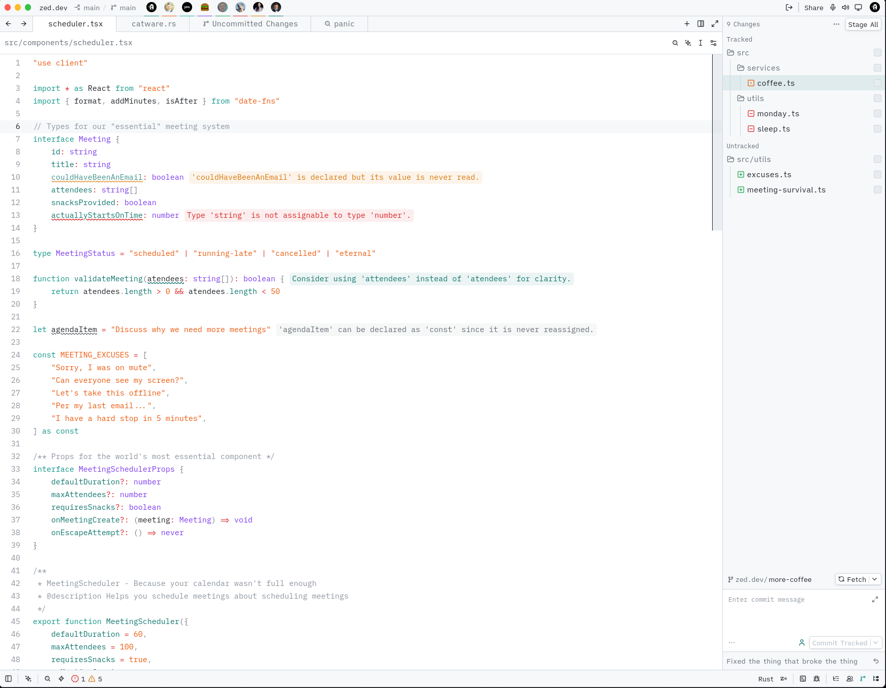

# Hadal

A deep-sea inspired theme for [Zed](https://zed.dev), available in both dark and light variants.

## Screenshots

### Dark

### Light

## Installation

1. Open Zed
2. Open the Command Palette (`cmd-k cmd-p` / `ctrl-k ctrl-p`)
3. Run `zed: extensions`
4. Search for **Hadal** and install it

## Local Development

Place `themes/hadal.json` in your Zed themes directory:

- **macOS / Linux:** `~/.config/zed/themes/`
- **Windows:** `%USERPROFILE%\AppData\Roaming\Zed\themes\`

## License

MIT
