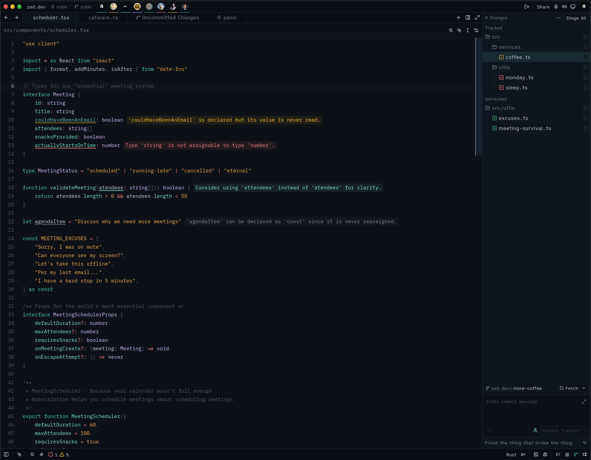

# Hadal

A deep-sea inspired theme for [Zed](https://zed.dev), available in both dark and light variants.



## Features

- **Both appearances** — 176 style keys each, full parity between dark and light
- **101 syntax captures** — comprehensive coverage of all syntax elements
- **16 terminal ANSI colors** — plus bright and dim variants for the integrated terminal
- **8 player colors** — for collaboration cursors
- **Vim mode support** — complete color definitions for all vim modes
- **Version control integration** — conflict markers, diff colors, and status indicators

## Install

### From the Zed extension store

1. Open Zed
2. `Cmd` `Shift` `P` → **zed: extensions**
3. Search for **Hadal**
4. Click **Install**

### As a dev extension

```sh
git clone https://github.com/maikel-479/hadal.git
```

1. In Zed: `Cmd` `Shift` `P` → **zed: install dev extension**
2. Select the cloned directory
3. `Cmd` `Shift` `P` → **theme selector: toggle** → pick **Hadal Dark**

## Switching

`Cmd` `K` `Cmd` `T` opens the theme selector, or `Cmd` `Shift` `P` →
**theme selector: toggle**.

To pin it, or to follow your system appearance, edit `settings.json`:

```json
{
  "theme": {
    "mode": "system",
    "light": "Hadal Light",
    "dark": "Hadal Dark"
  }
}
```

Or set one and be done:

```json
{
  "theme": "Hadal Dark"
}
```

## License

[MIT](LICENSE)

---

Built by [@maikel-479](https://github.com/maikel-479).
