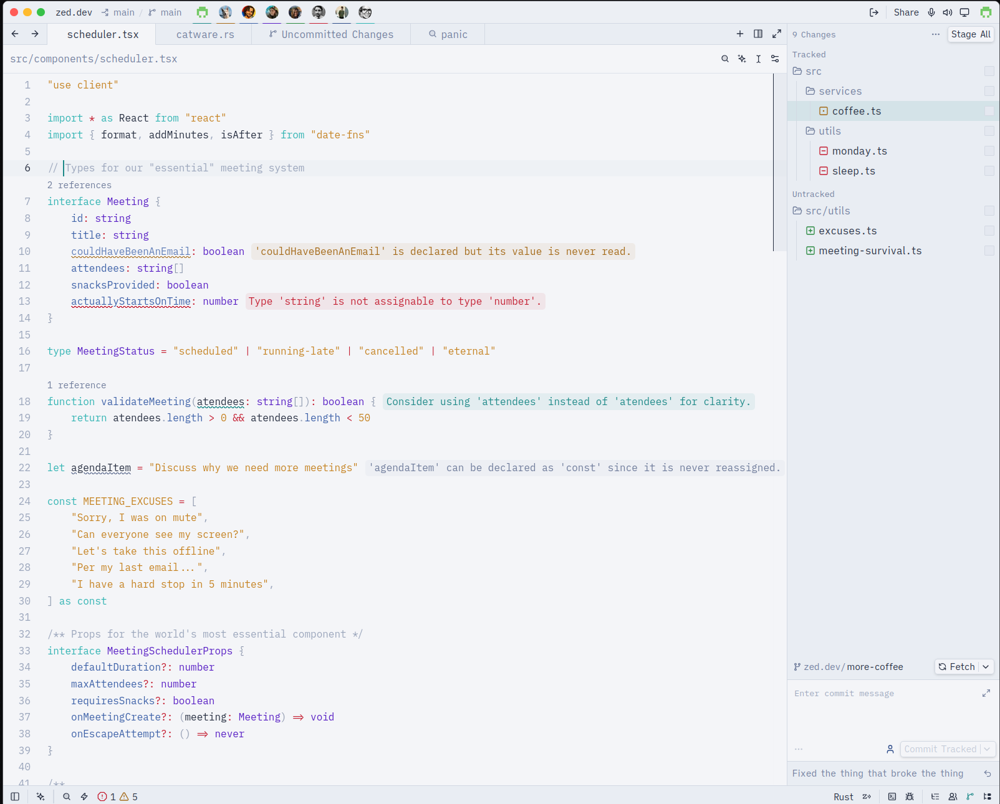
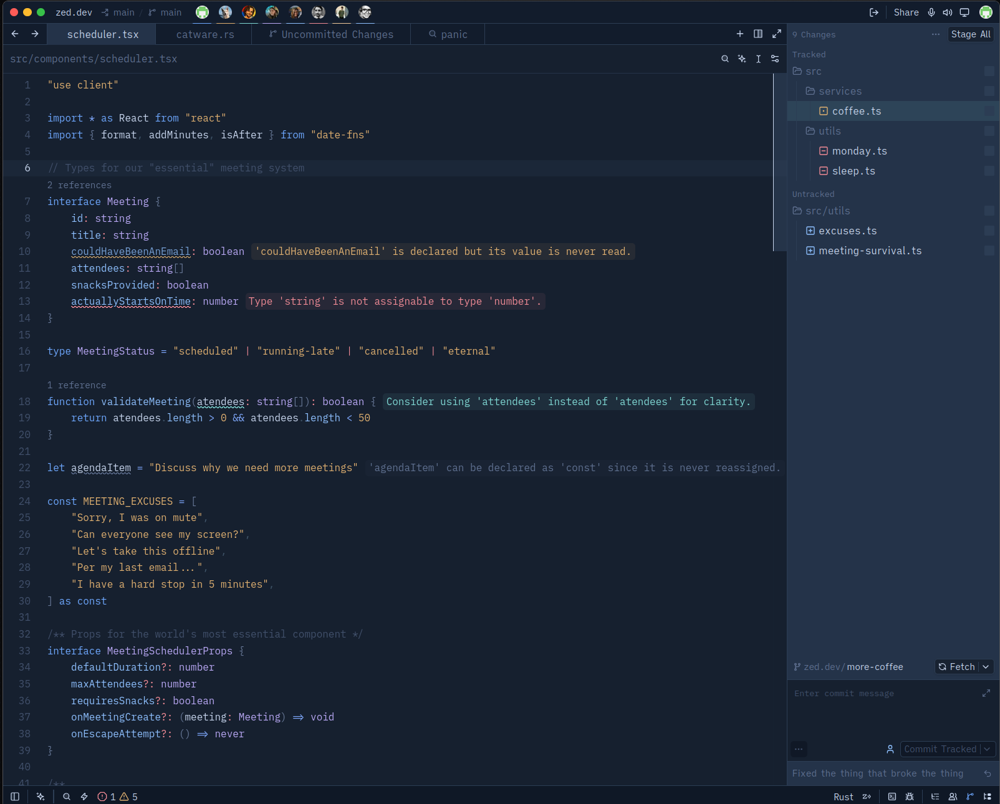
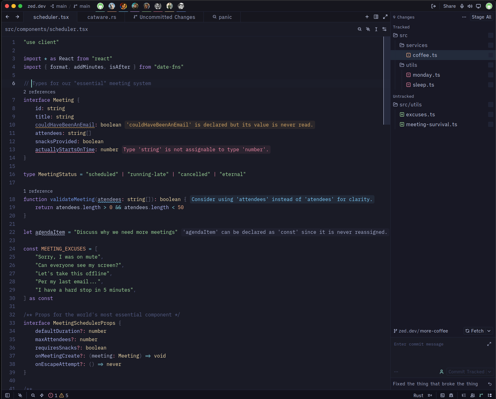

<div align="center">

# Hadal 

A deep-sea inspired theme set for [Zed](https://zed.dev), following light down through the ocean zones: Hadal Shallows, Hadal Deep, Hadal Twilight, and Hadal Midnight.

| Hadal Shallows | Hadal Deep | Hadal Twilight | Hadal Midnight |
|------------|------------|------------|------------|
|||||
  


</div>

## Features

- **Four variants** — Hadal Shallows, Deep, Twilight, and Midnight, 187 style keys each with full parity
- **Twilight depth-filtering** — warm hues dim with depth while blues stay vivid, after how water absorbs light
- **105 syntax captures** — comprehensive coverage of all syntax elements
- **16 terminal ANSI colors** — plus bright and dim variants for the integrated terminal
- **8 player colors** — for collaboration cursors
- **Vim mode support** — complete color definitions for all vim modes
- **Version control integration** — conflict markers, diff colors, and status indicators

## Install

### From the Zed extension store

1. Open Zed
2. `Cmd` `Shift` `P` → **zed: extensions**
3. Search for **Hadal**
4. Click **Install**

### As a dev extension

```sh
git clone https://github.com/maikel-479/hadal.git
```

1. In Zed: `Cmd` `Shift` `P` → **zed: install dev extension**
2. Select the cloned directory
3. `Cmd` `Shift` `P` → **theme selector: toggle** → pick **Hadal Deep**

## Switching

`Cmd` `K` `Cmd` `T` opens the theme selector, or `Cmd` `Shift` `P` →
**theme selector: toggle**.

To pin a variant, edit `settings.json`:

```json
{
  "theme": "Hadal Deep"
}
```

Or set Twilight or Midnight instead:

```json
{
  "theme": "Hadal Twilight"
}
```

## License

[MIT](LICENSE)

---

Built by [@maikel-479](https://github.com/maikel-479).
